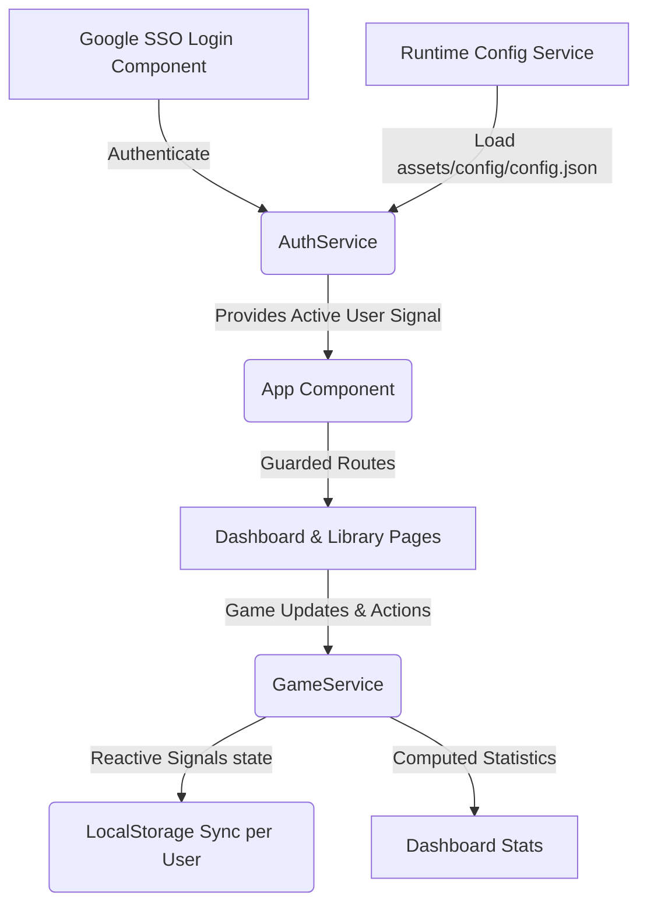

# 🎮 GameTracker

<div align="center">

[](https://angular.dev)
[](https://typescriptlang.org)
[](https://vitest.dev)
[](https://github.com/LuisMoralesMx/game-tracker)

<p align="center">
  A premium, cozy, and beautifully crafted game library management application. Track your gameplay progress, catalog your collection, and analyze your gaming journey in a warm, relaxing environment.
</p>

[✨ Key Features](#-key-features) • [🚀 Getting Started](#-getting-started) • [⚙️ Architecture](#-system-architecture) • [🧪 Testing](#-testing)

</div>

---

> [!NOTE]
> **Cozy Theme & Philosophy**: GameTracker is designed around a calming warm-cream (`#fbf9f6`) and amber (`#d97706`) palette using the beautiful **Outfit** and **Lora** Google Fonts. It moves away from cold, dark, generic interfaces to create a welcoming digital living room for your library.

---

## ✨ Key Features

*   **🔐 Google SSO & Authentication**: Fully integrated Single Sign-On using Google Identity Services. Secures routes automatically via dedicated Angular Route Guards.
*   **⚙️ Dynamic Runtime Configuration**: App settings (like the Google Client ID) are loaded dynamically at bootstrap from a public config file via Angular's `APP_INITIALIZER` token, avoiding hardcoded client secrets in build bundles.
*   **⚡ Reactivity with Angular Signals**: Full state management built using modern Angular reactivity. Game lists, search terms, active page status, and dashboard counts update instantly without unnecessary re-renders.
*   **📊 Real-time Dashboard**: Instantly view game status metrics, time played counters, active sessions, and completion ratios.
*   **📂 Isolated Local Storage**: Automatically loads and stores game libraries in browser local storage isolated by Google User ID, preserving user privacy.
*   **🏷️ Detailed Metadata & Custom Notes**: Save platforms, play duration in hours, 1–10 cozy ratings, start/completion dates, and personal logs for each entry.

---

## ⚙️ System Architecture

The following diagram illustrates how state, configuration, authentication, and view components interact reactively:



---

## 🛠️ Technology Stack

| Technology | Version | Purpose |
| :--- | :--- | :--- |
| **Angular** | `^22.0.0` | Core framework with Standalone Components and Signals |
| **TypeScript** | `~6.0.2` | Strictly-typed static analysis |
| **Vitest** | `^4.0.8` | High-performance unit testing |
| **RxJS** | `~7.8.0` | Reactive asynchronous event processing |
| **Prettier** | `^3.8.1` | Automated, clean code formatting |

---

## ⚡ Reactivity Highlight

GameTracker takes full advantage of modern Angular reactive patterns. For example, dashboard metrics are calculated dynamically using `computed` Signals:

```typescript
// From src/app/services/game.ts
import { signal, computed } from '@angular/core';

export class GameService {
  private readonly _games = signal<Game[]>([]);

  // Expose read-only games signal
  readonly games = this._games.asReadonly();

  // Reactively compute stats automatically when _games changes
  readonly totalGames = computed(() => this._games().length);
  readonly completedGames = computed(() => this._games().filter(g => g.status === 'Completed').length);
}
```

---

## 🚀 Getting Started

### 1. Prerequisites

Ensure you have **Node.js** (v18+) and **npm** installed on your system.

### 2. Installation

Clone this repository and install dependencies:

```bash
git clone https://github.com/LuisMoralesMx/game-tracker.git
cd game-tracker
npm install
```

### 3. Google SSO Configuration

To enable Google Single Sign-On, you must create a `config.json` file in the public directory:

1. Create a copy of the configuration template:
   ```bash
   cp public/assets/config/config.json.placeholder public/assets/config/config.json
   ```
   *(Or simply create the folder structure and file `public/assets/config/config.json` manually).*
2. Edit `public/assets/config/config.json` to include your Google OAuth Client ID:
   ```json
   {
     "googleClientId": "YOUR_GOOGLE_CLIENT_ID.apps.googleusercontent.com"
   }
   ```

### 4. Running the Development Server

Start a local development server:

```bash
npm start
```

Once the server is running, navigate to `http://localhost:4200/`. The application will automatically reload whenever you modify any source files.

---

## 🧪 Testing

To execute unit tests using the modern [Vitest](https://vitest.dev/) test runner:

```bash
npm test
```

For continuous testing during development (watch mode):

```bash
npx vitest
```

---

## 📦 Building

To build the project for production, run:

```bash
npm run build
```

This compiles your project and stores the build artifacts in the `dist/` directory. By default, the production build optimizes the application for speed, size, and efficiency.
